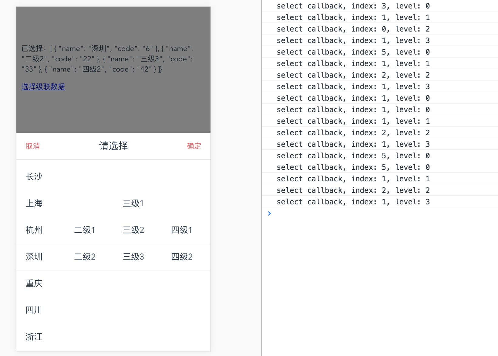

A cascaded or non cascade selection or picker container with Vue.js, which does not support PC.

<p>
  <a href="https://www.npmjs.com/package/select-container"></a>
  <a href="https://www.npmjs.com/package/select-container"></a>
</p>


## Install
```
$ npm install select-container --save
```

## How to use
```html
<template>
  <select-container
    v-if="showSelect"
    :cascadeData="cascadeData"
    :selected="selected"
    @selectCallback="handleSelect"
    @confirmSelect="confirmSelect"
    @cancelSelect="cancelSelect">
  </select-container>
</template>

<script>
import SelectContainer from 'select-container'

export default {
  data () {
    return {
      // Two-dimensional array
      // [ [{name: '北京', code: '010'}], ... ]
      cascadeData: [],
      // [{name: '北京', code: '010'}, ...]
      selected: []
    }
  },
  components: {
    SelectContainer
  }
}
</script>
```

## Props and methods

name | description
-----|-------
cascadeData | [[ {name: '北京', code: 1} ], ... ]
selected | the same
selectCallback | triggered callback function
confirmSelect | receive one parameter
cancelSelect | close select

## Performance

